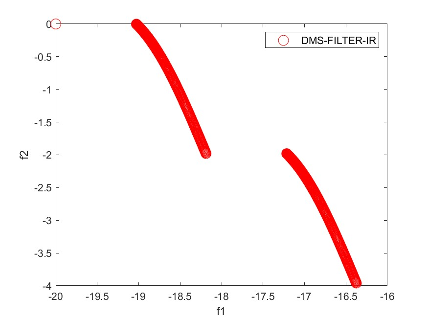

<p>
  
</p>

##  Inexact Restoration Direct Multisearch Filter Approach to Multiobjective Constrained Derivative-free Optimization - DMS-FILTER-IR

Implementation of the DMS-FILTER-IR framework proposed in 

[Silva, E. J., Cust\'odio, A. L. (2024). An inexact restoration direct multisearch filter approach to multiobjective constrained derivative-free optimization. Optimization Methods and Software, 1–27.](https://doi.org/10.1080/10556788.2024.2412646)

If you have used our code for research purposes, please cite the publication mentioned above.
For the sake of simplicity, we provide the Bibtex format:

```
@article{Silva_Custodio_2024,
author = {Everton J. Silva and Ana Lu\'isa Cust\'odio},
title = {An inexact restoration direct multisearch filter approach to multiobjective constrained derivative-free optimization},
journal = {Optimization Methods and Software},
volume = {0},
number = {0},
pages = {1--27},
year = {2024},
publisher = {Taylor \& Francis},
doi = {10.1080/10556788.2024.2412646},
url = {https://doi.org/10.1080/10556788.2024.2412646},
eprint = {https://doi.org/10.1080/10556788.2024.2412646}
}
```

### Main Dependencies Installation

Welcome to DMS-FILTER-IR Version 1 December, 2023!

This file describes the following topics:

1. System requirements
2. Installation
3. Contents of the DMS-FILTER-IR directory 
4. The command line


### 1. System requirements
----------------------------------------

Your computer should have a Matlab numerical compiler installed.

### 2. Installation
----------------------------------------

The code requires approximately 75Kb of hard disk space. If you are running
the code on an Unix/Linux platform, then the following commands should be 
executed to unpack the compressed files:

        gunzip -c DMS-FILTER-IR.tar.gz | tar xvf -

In a Windows platform use Unzip for the same purpose.

A directory named DMS-FILTER-IR will be created, either in Windows or
Unix/Linux operating systems. This directory must be moved to a working
directory in the Matlab tree. Alternatively, the Matlab path could be
updated accordingly.

The DMS parameters can be modified in the file parameters_dmsFilter.m
under the DMS-FILTER-IR directory. 


### 3. Contents of the DMS-FILTER-IR directory
----------------------------------------

In the directory DMS-FILTER-IR there are the following files:

  driver_DMSFILTERIR.m       A driver for a derivative-free multiobjective problem.

  README.txt                 The current file.

  ---------------------------
  User provided Matlab files:
  ---------------------------

  func_F.m              To compute the value of the objective function.

  func_C.m              To compute the values of the constraint functions,
                        other than bounds.

  search_step_filter.m  To implement a search step for the algorithm.

  -----------------------
  Optimizer Matlab files:
  -----------------------

  dms_filter_IR.m          The main program. Applies a direct multisearch method.

  match_point.m            Checks if a point has been previously evaluated.

  parameters_dmsFilter.m   A file with default values for the parameters to be
                           used by DMS.

  paretodominance.m        Checks if a point is dominated by any point of a
                           provided list.

  sort_filter.m            Orders a list of  nondominated points

  most_isolated.m          Order a list of feasible nondomindated points according to the most isolated point

  restoration_phase.m and func_IR.m files related to the inexact restoration step, where the IR problem is solved using fmincon

  barrier_fun.m and GPS.m files related to the computation of randon directions as it done in MADS (BOOK Audet \& Hare 2017)

  GSS_ABDP.m Compute directions comforming to the boundary of nearby constraints

### 4. The command line 
----------------------------------------
 
Before running DMS-FILTER-IR, the user should provide the necessary information
about the objective function in the file func_F.m, the constraints in the file 
func_C.m and set the algorithmic options in the file parameters_dmsFilter.m. 
Next, at the directory DMS-FILTER-IR, the user should type:

 [Plist,Flist,alfa,func_eval] = dms_filter_IR(Pareto_front,func_F,file_ini,...
                                   file_cache,x_ini,lbound,ubound,func_C);

where the following data has to be provided:

  - Pareto_front (0-1 variable: 1 if the complete Pareto front
                 should be computed; 0 if only one point in
                 the Pareto front is required);

  - func_F (name of the file defining the objective function);

  - file_ini (name of the file used for initialization);

  - file_cache (name of the file where a previous cache was saved);

  - x_ini (initial point to be considered); 

  - lbound (lower bounds on the problem variables);

  - ubound (upper bounds on the problem variables);

  - func_C (name of the file for computing other problem constraints).

If x_ini is not provided but list (in parameters_dmsFilter.m) is set equal to 0 
and bounds are defined, then x_ini is set equal to (lbound + ubound) / 2.

For a quick start, or to confirm that the DMS-FILTER-IR installation was
completed successfully, the user can run the driver Driver_DMSFILTERIR.m.


### Contact

If you have any question, feel free to contact us:

[Everton Silva](https://github.com/EvertonJdaSilva)<br>
Center for Mathematics and Applications ([NOVAMATH](https://novamath.fct.unl.pt/))<br>
NOVA University of Lisbon<br>
Email: evertonjosedasilva570 at gmail dot com
       ejo dot silva at campus dot fct dot unl dot pt